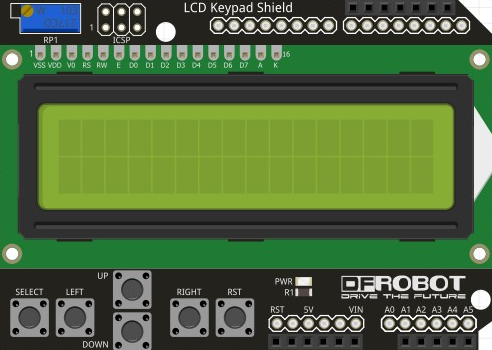
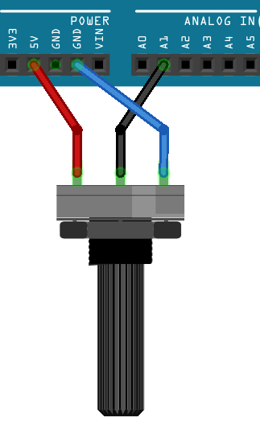
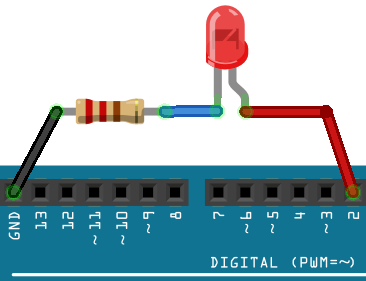
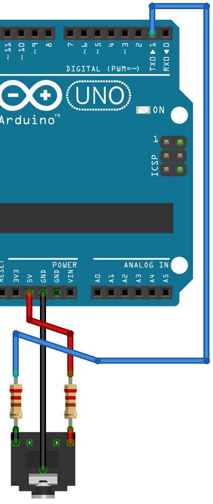

# Arduino Midi Clock

This little project includes software and hardware implementations to achieve a compact and simple midi clock generator.

## Scematics

### LCD Keypad Shield

### Rotary BPM Selector

### Beat LED Indicator

### MIDI Output

